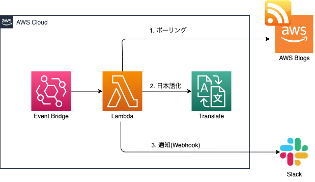
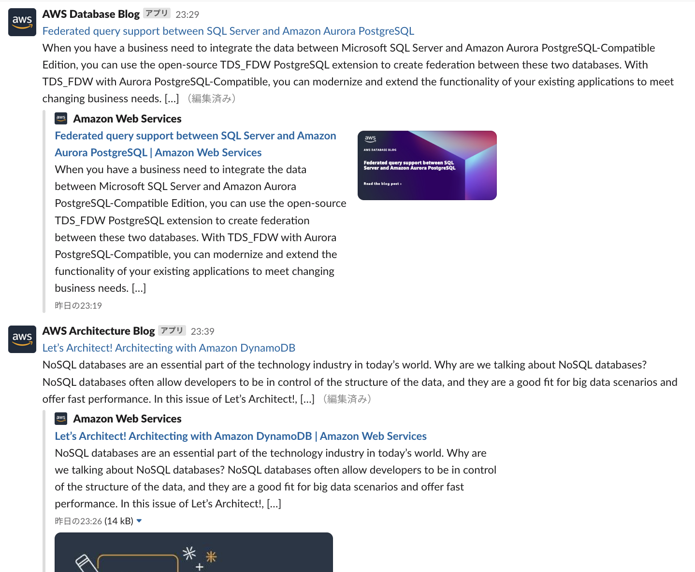
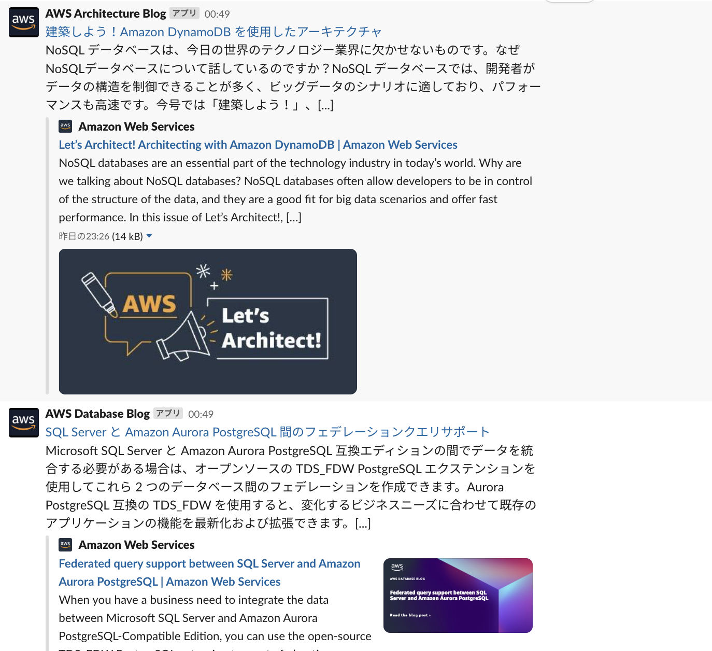

# RSS Feed Translater

## これは何？

AWS から英語で提供されている RSS を Amazon Translate で日本語化して Slack へ通知します。

対象の RSS は[AWS Blogs](https://aws.amazon.com/blogs/)と[What's New with AWS](https://aws.amazon.com/about-aws/whats-new/2022)です。  
詳細は[src/feed.ts](./src/lib/feed.ts)をご確認ください

### アーキテクチャ



### 実行イメージ

| 翻訳前                       | 翻訳後                       |
| ---------------------------- | ---------------------------- |
|  |  |

## デプロイ

### 1.パラメーターストアの設定

デプロイ前に以下をパラメーターストアに登録する必要があります

- `/RSS_FEED_TRANSLATER/SLACK_INCOMING_WEBHOOK-URL-BLOGS`
  - AWS Blogs の通知先となる Slack の WebhookURL
- `/RSS_FEED_TRANSLATER/SLACK_INCOMING-WEBHOOK-URL-ANNOUNCEMENTS`
  - What's New の通知先となる Slack の WebhookURL

### 2. デプロイ

```bash
$ npx cdk deploy
```
